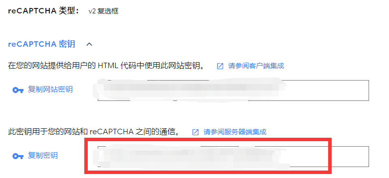

<div style="text-align: center"><h2>NekoBlog Backend</h2></div>

 [](./LICENSE "LICENSE")

安装依赖
```shell
pip install -r requirements.txt
```

<hr>
本项目仅为RESET API

环境要求: Python >= 3.9.0, MySQL >= 5.7.26 , MySQL引擎 = MyISAM
<hr>

运行
```shell
python3 manage.py runserver 127.0.0.1:2333
```

<hr>

数据库配置(NekoBlog/configs/db.json)
```json
{
  "host": "localhost",
  "port": 3306,
  "user": "neko",
  "password": "123456",
  "database": "neko_blog"
}
```

<hr>

Redis配置(NekoBlog/configs/db.json)
```json
{
  "host": "localhost",
  "port": "6379",
  "pwd": "123456"
}
```

<hr>

Recaptcha配置(NekoBlog/configs/recaptcha.json)
```json
{
  "enable": false,
  "key": "填入Recaptcha配置秘钥"
}
```


<hr>

## RSA证书配置(NekoBlog/keys)

请将

RSA公钥命名为rsa_public_key.pem

RSA私钥命名为rsa_private_key.pem

并置于 NekoBlog/keys 目录下

<hr>

## 初始化设置
```shell
python start.py Admin admin@example.com password 用户名
```

<hr>

## 文章上传
```shell
# uuid 作者uuid
# title 文章标题
# name 文章标记,限英文大小写、数字、-、_、(、)
# comment 是否允许评论 true or false
# preview 封面链接
python upload.py uuid filename title category other comment preview
```